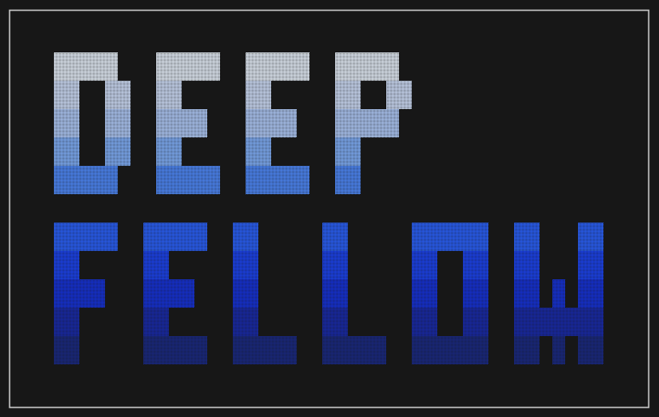

<div align="center">



# DeepFellow CLI

Privacy-First AI Infrastructure Framework — deploy and manage private AI on your own infrastructure.

[Docs](https://docs.deepfellow.ai) · [Quickstart](https://docs.deepfellow.ai/docs/quickstart) · [Architecture](https://docs.deepfellow.ai/docs/architecture) · [License](https://deepfellow.ai/deepfellow-free-license)

</div>

---

`deepfellow-cli` is the command-line tool for installing, configuring, and managing [DeepFellow](https://deepfellow.ai) — a framework for running AI models on your own infrastructure with full data control, an OpenAI-compatible API, and a modular plugin system for prompt filtering, anonymization, and response validation.

## Requirements

- [Git](https://git-scm.com/install/) ≥ 2.30.0
- [Python](https://www.python.org/downloads/) ≥ 3.10
- [Docker Engine](https://docs.docker.com/engine/install/) ≥ 28.0.0
- Package manager: [uv](https://docs.astral.sh/uv/), [pipx](https://pipx.pypa.io/stable/installation/), or pip

## Installation

```bash
curl https://deepfellow.ai/install.sh | bash
```

Verify with `deepfellow --help`.

To uninstall:

```bash
uv tool uninstall deepfellow-cli    # or pipx / pip3 uninstall
```

## Quickstart

### 1. Set up Infra (model hosting layer)

```bash
deepfellow infra install    # interactive — configures API keys, Docker network, etc.
deepfellow infra start
```

### 2. Install a model

```bash
deepfellow infra service install ollama
deepfellow infra model install ollama gemma3:1b
```

Pick a model that fits your VRAM — see our [model recommendations](https://docs.deepfellow.ai/docs/installation#install-first-model) and [Supported Models](https://docs.deepfellow.ai/docs/supported-models) for guidance.

### 3. Set up Server (API & management layer)

```bash
deepfellow server install   # interactive — configures MongoDB, Qdrant, DeepFellow Infra connection
deepfellow server start
```

### 4. Create admin & log in

```bash
deepfellow server create-admin
deepfellow server login
```

### 5. Create organization, project & API key

```bash
deepfellow server organization create "My Company"
export ORG_ID=u4hdn4uamdu4hs
deepfellow server project create $ORG_ID "My Project"
export PROJ_ID=amdu4hsu4hdn4u
deepfellow server project api-key create $ORG_ID $PROJ_ID "my-key"
```

Done. Your private AI is running and accepting OpenAI-compatible API requests.

## CLI Reference

### Non-interactive mode

Majority of commands run interactively by default. For scripting and automation, pass `--non-interactive` with the required options:

```bash
export DF_INFRA_API_KEY=dfapi-u4hdn4u-amdu4hs-cbgurg-223hdgr
deepfellow --non-interactive infra install
deepfellow --non-interactive server install \
  --infra-url https://infra.local:8086
```

Every interactive prompt has a corresponding `--flag`. Run any command with `--help` to see all available options.

### Infra

```bash
deepfellow infra install                             # Interactive setup
deepfellow infra start / stop                        # Start / stop DeepFellow Infra containers
deepfellow infra info                                # Show config & env vars
deepfellow infra ssl-on                              # Configure SSL
deepfellow infra service install                     # Add model backend (ollama, vllm, …)
deepfellow infra service uninstall                   # Remove backend + its models
deepfellow infra model install                       # Pull a model
deepfellow infra model uninstall                     # Remove a model
deepfellow infra connect                             # Attach to a multi-node Mesh
deepfellow infra disconnect                          # Disconnect from Mesh
deepfellow infra env set                             # Set / unset env variable
deepfellow infra uninstall                           # Full removal
```

### Server

```bash
deepfellow server install                            # Interactive setup
deepfellow server start / stop                       # Start / stop DeepFellow Server containers
deepfellow server info                               # Show config & env vars
deepfellow server create-admin                       # Create admin account
deepfellow server login                              # Authenticate for CLI admin tasks
deepfellow server password-reset                     # Reset user password
deepfellow server organization create                # Create an organization
deepfellow server project create                     # Create a project
deepfellow server api-key create                     # Generate an API key
deepfellow server env set                            # Set / unset env variable
deepfellow server uninstall                          # Full removal
```

## Configuration

All state lives in `~/.deepfellow/` — env files, Docker Compose configs, secrets, and model storage. Use `deepfellow infra info` or `deepfellow server info` to inspect current settings, or `env set` to modify them. See [Installation docs](https://docs.deepfellow.ai/docs/installation#envs) for the full list of environment variables.

## Learn More

- [Architecture](https://docs.deepfellow.ai/docs/architecture) — Server, Infra, and Mesh topology
- [Plugins](https://docs.deepfellow.ai/docs/plugins) — Prompt filtering, anonymization, response evaluation
- [Integrations](https://docs.deepfellow.ai/docs/integrations) — LangChain, Sindri, vector stores, MCP toolbox
- [Supported Models](https://docs.deepfellow.ai/docs/supported-models) — Full list with VRAM requirements
- [Security & Control](https://docs.deepfellow.ai/docs/security-and-control) — Data sovereignty, access management
- [Running on AWS](https://docs.deepfellow.ai/docs/aws) — Cloud deployment guide
- [API Reference](https://docs.deepfellow.ai/docs/reference) — OpenAI-compatible endpoints

## Contributing & Releasing

See [RELEASE.md](RELEASE.md) for the release process.

## License

[DeepFellow Free License](https://deepfellow.ai/deepfellow-free-license) — free for personal use and organizational R&D. Commercial use requires a [commercial license](https://deepfellow.ai).

## About

Built by [Simplito](https://simplito.com) in Toruń, Poland — creators of [PrivMX](https://privmx.dev).

[deepfellow.ai](https://deepfellow.ai) · [GitHub](https://github.com/simplito/deepfellow-cli) · [contact@simplito.com](mailto:contact@simplito.com)
